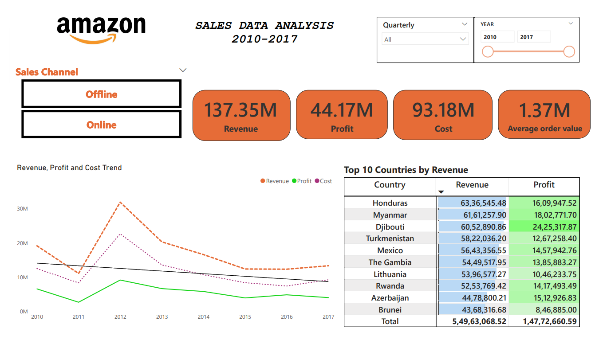
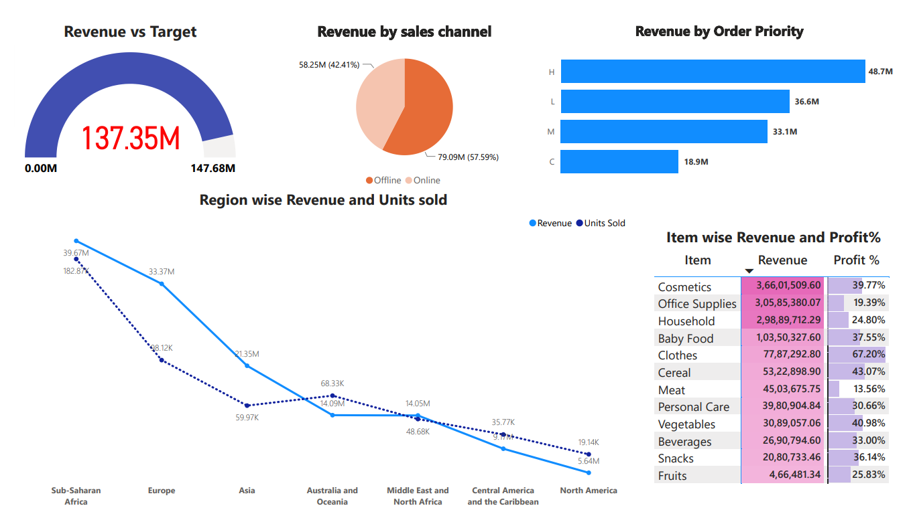
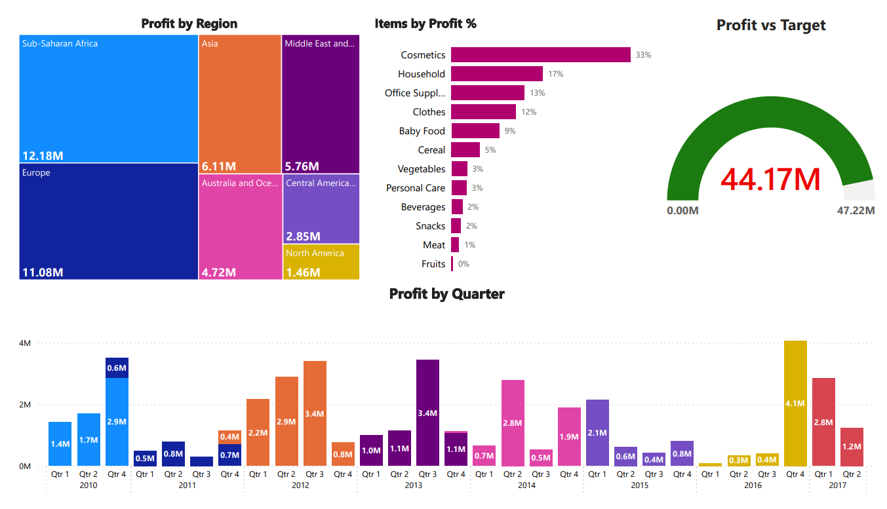

# Amazon_Sales_Analysis

### Overview
This project aims to analyze Amazon sales data using SQL for data processing and Power BI for data visualization. The goal is to provide insights into sales performance, customer behavior, and product trends.

### Features

- Data Processing with SQL: Extract, transform, and load (ETL) operations to clean and prepare the sales data.

- Interactive Dashboards: Visualize key metrics such as total sales, top-selling products, and customer demographics using Power BI.

- Sales Dashboard: An interactive dashboard displaying key sales metrics.
- Trend Analysis: Visualizations showing sales trends over time.
- Category Analysis: Insights into sales performance by product category.
- Geographic Analysis: Sales distribution across different regions.
- Customer Insights: Analysis of customer purchasing behavior.

### Tools Used: PowerBI and SQL
 
